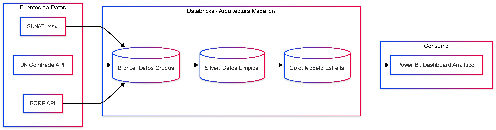

# Planteamiento Analítico: Comercio Exterior Peruano

**Autor:** Ronny Méndez / ramendez-fe

**Fecha:** Septiembre 2026

---

## 1. Resumen Ejecutivo

Este proyecto consiste en el diseño e implementación de un *pipeline* de datos escalable bajo una arquitectura Medallón (Data Lakehouse). Su objetivo es procesar, normalizar y modelar registros del comercio exterior peruano, aplicando conversiones con tasas de cambio históricas oficiales. El resultado es un modelo dimensional optimizado que permite a las áreas de negocio analizar el crecimiento real de las exportaciones y medir el riesgo por concentración de mercados.

## 2. Pregunta de Negocio

> *¿Qué sectores de exportación peruana crecieron o se contrajeron más en términos reales (ajustados por tipo de cambio histórico) durante la última década, y cuán concentrada está dicha exportación en pocos países de destino?*

## 3. KPIs a Desarrollar

El modelo de datos y la capa semántica están diseñados para alimentar las siguientes métricas:

1. **Crecimiento Real:** Variación interanual del valor exportado por sector, expresado estrictamente en USD constantes.
2. **Ranking de Mercados:** Top-5 países destino por sector y año.
3. **Riesgo de Dependencia (HHI):** Índice de concentración de Herfindahl-Hirschman por sector.
*Fórmula:* `HHI = SUM( (participacion_pais_%)^2 )` (Escala 0 - 10,000).
4. **Auditoría Financiera:** Tipo de cambio promedio aplicado por año (métrica de control para validar el cruce de monedas).

## 4. Alcance Temporal (MVP)

**2005 (Minimum Viable Product).** El diseño original de la arquitectura está preparado para ingerir, procesar y modelar décadas completas de información histórica y múltiples sectores a la vez. Sin embargo, para fines de este MVP (Producto Mínimo Viable) y demostración técnica *end-to-end*, el alcance se ha acotado a un año base (2005) con un producto específico (café) como prueba de concepto. 

Al estar toda la tubería de datos (*pipeline*) 100% parametrizada desde la capa Bronze, este modelo es fácilmente **extrapolable y escalable a diferentes años, rangos temporales o múltiples partidas arancelarias** con tan solo modificar las variables de ingesta inicial, sin necesidad de reescribir la lógica de negocio de las capas Silver o Gold.

## 5. Ecosistema de Datos

El proyecto integra fuentes heterogéneas, simulando los desafíos de ingesta del mundo real:

| Fuente | URL Base | Formato | Aporte al Proyecto |
| --- | --- | --- | --- |
| **SUNAT (Aduanas)** | `sunat.gob.pe/estadisticasestudios/` | `.xlsx` | Fuente primaria. Detalle transaccional de exportaciones por partida arancelaria y país destino. |
| **UN Comtrade** | `comtradeapi.un.org` | API REST | Estandarización global (HS) para habilitar *benchmarking* contra otras economías. |
| **BCRP** | `estadisticas.bcrp.gob.pe` | API REST | Serie diaria oficial de tipo de cambio bancario (Venta), esencial para la conversión a USD constantes. |

### 5.1. Desafíos Técnicos y Limitaciones Conocidas

* **SUNAT:** Los reportes incluyen metadatos de presentación (filas de encabezado combinadas) que requieren rutinas de limpieza paramétrica en la capa Silver.
* **BCRP:** Los días no laborables o feriados figuran sin cotización (`"n.d."`). Se implementarán técnicas de *forward-fill* mediante funciones de ventana para garantizar la cobertura total de fechas.
* **UN Comtrade:** Manejo estricto de cuotas y *rate limiting* (límite de 500 registros en modo *preview*, requiriendo paginación para extracción masiva).

## 6. Stack Tecnológico

* **Lenguajes:** Python 3.10+ (PySpark, Pandas, Requests), SQL.
* **Procesamiento y Computación:** Azure Databricks (Workflows).
* **Almacenamiento:** Delta Lake.
* **Control de Versiones y CI/CD:** Git, GitHub, Jenkins (Pruebas unitarias con `pytest`).
* **Visualización:** Power BI (DirectQuery / Import al esquema Gold).

## 7. Arquitectura del Pipeline

El flujo de datos sigue el patrón Medallón de Databricks:

1. **Capa Bronze (Raw):** Ingesta cruda y auditable con metadatos de extracción.
2. **Capa Silver (Cleansed):** Tipado, desduplicación y conciliación compleja de monedas exactas por fecha.
3. **Capa Gold (Curated):** Modelo en estrella (1 Tabla de Hechos y 3 Dimensiones con claves sustitutas) listo para el consumo analítico.

